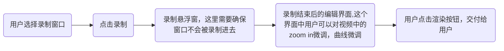

## 项目基本介绍

这个文件夹中是wails框架下的一个vue-go项目，他是一个适用于windows环境的电脑录屏解决方案。

**核心解决的问题：**

按下开始录制键后，将会录制选定的屏幕，同时记录鼠标的位置和状态。当鼠标点击时候zoom in镜头，并在最终形成MP4视频。


这个项目对标的是`OpenScreen` ，项目名称是`SilkRec` ，现在我已经：

1. 使用wails进行了框架的初始化
2. 完成了三个核心功能的校验（获取屏幕、获取鼠标位置、调用PixiJS进行缩放），后面我会为你介绍这些功能的测试具体代码。


## 项目搭建指南

请你按照我的布局进行项目的搭建

### 1.总体目录结构树

```bash
my-recorder/
├── build/                  # Wails 打包产物目录
├── frontend/               # 前端代码 (Vue + TS)
│   ├── src/
│   │   ├── assets/         # 静态资源
│   │   ├── components/     # UI 组件 (按钮、控制条)
│   │   ├── core/           # ★ 核心逻辑层 (引擎) - 最重要！
│   │   │   ├── recorder/   # 负责调用 WebCodecs 和 getDisplayMedia
│   │   │   ├── editor/     # 负责 PixiJS 渲染、画布管理
│   │   │   └── math/       # 负责贝塞尔曲线、平滑算法
│   │   ├── stores/         # 状态管理 (Pinia)
│   │   ├── views/          # 页面 (录制页、编辑器页)
│   │   ├── App.vue
│   │   └── main.ts
│   ├── index.html
│   ├── package.json
│   └── wailsjs/            # Wails 自动生成的 Go 绑定文件 (勿动)
├── pkg/                    # ★ Go 后端核心包
│   ├── hook/               # 鼠标/键盘监听逻辑 (gohook)
│   ├── sys/                # 系统级操作 (窗口置顶、DPI获取)
│   └── io/                 # 文件读写 (保存视频块)
├── app.go                  # Wails 桥接层 (只负责转发，不写逻辑)
├── main.go                 # 程序入口
└── wails.json
```


### 2.核心模块详细拆解

#### A.后端部分（GO）

**`pkg/hook/cursor.go`**

- **职责**：启动一个 Goroutine，使用 `robotgo` 或 `github.com/moutend/go-hook` 监听全局鼠标。
- **关键点**：不要直接把所有数据发给前端（频率太高会卡死）。建议建立一个缓冲区，每 16ms (60FPS) 或者积累 10 个点打包通过 `runtime.EventsEmit` 发送一次给前端。

**`pkg/io/file_writer.go`**

- **职责**：接收前端传来的二进制数据块 (Chunks)，追加写入到本地 `.mp4` 文件中。
- **原因**：前端浏览器内存有限，不能一直存在 Blob 里，必须流式写入硬盘。

**`app.go`**

- 职责：作为API网关


#### B.前端部分（Vuejs）

这是这个程序的核心功能处理部分，使用js进行书写

这个部分的组件可以直接参考项目树，重点强调其中的UI控制流：



***

### 3.数据流全景图

#### 阶段1：录制

1. user点击按钮，开始录制

2. Vue获取屏幕流，但是不直接存储，存在内存Canvas上（为了后续的高效处理）

3. Go开始采集鼠标坐标位置，和鼠标的特殊动作（click、hold等），存入内存切片`WaitList`

4. Go创建空的`raw.mp4`文件

5. Loop：

   - 前端 Canvas 每一帧 -> `VideoEncoder` -> `Bytes` -> 传给 Go 写入文件。

   - Go 每一秒 -> 将 `WaitList` 里的鼠标数据 Dump 到一个 `mouse_data.json` 文件。

#### 阶段 2: 编辑 (Editing)

1. **Vue** 加载 `raw.mp4` 给 PixiJS 的 `VideoResource`。
2. **Vue** 加载 `mouse_data.json`，通过 `Smoother.ts` 计算出平滑路径。
3. **PixiJS** 循环渲染：
   - 当前是第 N 帧 -> 视频跳到 N 帧。
   - 查表找到第 N 帧鼠标应该在的位置 (插值计算)。
   - 绘制鼠标 Sprite。
   - 根据预设逻辑计算 `Stage.scale` 实现自动缩放。

***

## 关键性建议：

### 1.工作流设计

**录制时**：

- Wails/Go 仅负责调用系统 API 录制**无损、无鼠标**的原始视频流（保存到临时文件）。同时记录鼠标 JSON。

**编辑/预览时**：

- 前端加载视频和 JSON，使用 PixiJS 实时预览（这一步不消耗很多资源，因为只是播放）。

**导出时 (GPU 工作流)**：

- **前端**启动“离屏渲染模式”。
- PixiJS 逐帧更新画面。
- 创建 `new VideoEncoder(...)`。
- 将 Canvas 转换为 `VideoFrame` 喂给 Encoder。
- `VideoEncoder` 输出编码后的 Chunk。
- 通过 Wails 将 Chunk 传给 Go，Go 只是简单地把数据追加写入 `.mp4` 文件。


### 2.`GPU`渲染提升`ffmpeg`渲染性能

我们需要参考`OBS`的`0拷贝`思想，避免`ffmpe`g渲染堵塞进程

**渲染**：PixiJS 在 `<canvas>` (WebGL) 上绘制视频、平滑鼠标和缩放效果。此时纹理在 GPU 上。

**捕捉**：使用 `canvas.captureStream()` 或者创建 `VideoFrame` 对象。

**编码**：调用浏览器原生的 **WebCodecs API (`VideoEncoder`)**。

- *关键点*：现代浏览器（Edge/Chrome）的 `VideoEncoder` 底层直接调用了系统的硬件编码器（NVENC, Intel QSV, AMD VCE）。
- *优势*：纹理不需要读回 CPU 内存（或者通过极其优化的内部路径），直接在显存内完成“渲染 -> 编码”。

**封装**：编码后的数据块（Encoded Chunks）是非常小的二进制数据，这时候再传给 JS 库（如 `mp4box.js`）或者传给 Go 后端写入文件。

### 3.关键性验证

**这是现在代码中的成果，这是经过排查已经搞定了的问题，不要再犯同样的错误！**

你可以参考这个文件完成工作

/helloword.vue

/app.go

现在这两个文件完成了

- 屏幕的录制工作
- 获取鼠标的位置信息，并传输到前端中
- 现在的屏幕获取并没有隐藏鼠标，真正的录制时候需要**隐藏鼠标！**


/PixiVideoZoom.vue

完成了调用`PixiJs`实现视频的缩放

**请注意**：`PixiJS` 是`V8`版本，**这个版本中和之前会有区别！**


**以上是目前的基本框架，请按照这上面的内容完成搭建！**