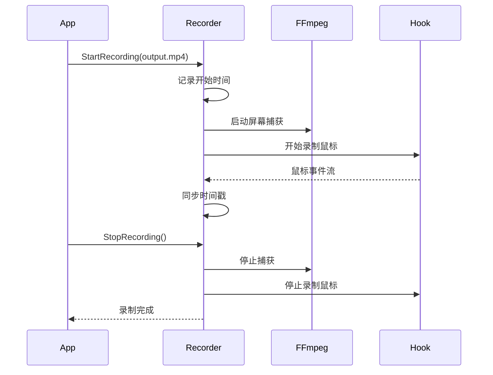

# Phase 1: 后端录制引擎详细实现计划

## 文件结构

```
SilkRec/
├── pkg/
│   ├── ffmpeg/
│   │   └── ffmpeg.go           # FFmpeg 路径管理器
│   ├── recorder/
│   │   ├── ffmpeg_capture.go   # FFmpeg 屏幕捕获核心
│   │   ├── ffmpeg_command.go   # FFmpeg 命令构建器
│   │   ├── recorder.go         # 统一录制管理器
│   │   └── pipe_writer.go      # FFmpeg stdin 管道写入器（Phase 3）
│   └── hook/
│       └── cursor.go           # 鼠标钩子（修改）
├── app.go                      # 应用主逻辑（修改）
├── main.go                     # 入口文件
└── go.mod                      # Go 模块依赖
```

## 1. pkg/ffmpeg/ffmpeg.go

### 功能
- 管理 FFmpeg 可执行文件路径
- 检测 FFmpeg 是否可用
- 获取 FFmpeg 版本信息

### 主要方法
```go
type FFmpegManager struct {
    ctx        context.Context
    ffmpegPath string
}

// GetFFmpegPath() (string, error) - 获取 FFmpeg 路径
// CheckFFmpegAvailable() bool - 检查 FFmpeg 是否可用
// GetFFmpegVersion() (string, error) - 获取 FFmpeg 版本
```

## 2. pkg/recorder/ffmpeg_command.go

### 功能
- 构建 FFmpeg 命令行参数
- 支持多种捕获方法（ddagrab, gdigrab）
- 支持多种编码器（h264_nvenc, libx264）

### 主要方法
```go
type CaptureConfig struct {
    OutputPath      string  // 输出文件路径
    FrameRate       int     // 帧率（默认 60）
    Codec           string  // 编码器（h264_nvenc 或 libx264）
    Quality         int     // 质量参数
    Preset          string  // 编码预设
}

// BuildDDAGrabCommand(ffmpegPath string, config CaptureConfig) []string
// 构建 ddagrap 命令（推荐，使用 lavfi 滤镜）

// BuildGDIRABCommand(ffmpegPath string, config CaptureConfig) []string
// 构建 gdigrab 命令（回退方案）

// DetectBestCodec(ffmpegPath string) (string, error)
// 检测最佳编码器（优先 h264_nvenc）
```

### ddagrab 命令示例
```bash
ffmpeg -y -f lavfi -i ddagrab=framerate=60:draw_mouse=0 \
       -c:v h264_nvenc -qp 20 -preset p4 output.mp4
```

### gdigrab 命令示例（回退）
```bash
ffmpeg -y -f gdigrab -framerate 60 -i desktop \
       -c:v libx264 -preset ultrafast output.mp4
```

## 3. pkg/recorder/ffmpeg_capture.go

### 功能
- 执行 FFmpeg 进程
- 管理进程生命周期
- 处理进程错误和输出

### 主要方法
```go
type FFmpegCapture struct {
    cmd      *exec.Cmd
    process  *os.Process
    isRunning bool
    output   string
    error    string
}

// Start(ffmpegPath string, args []string) error - 启动 FFmpeg 进程
// Stop() error - 停止 FFmpeg 进程
// IsRunning() bool - 检查是否正在运行
// GetOutput() string - 获取输出日志
// GetError() string - 获取错误信息
```

## 4. pkg/recorder/recorder.go

### 功能
- 统一管理视频录制和鼠标事件捕获
- 同步视频和鼠标时间戳
- 提供录制状态查询

### 主要方法
```go
type Recorder struct {
    ffmpegManager *ffmpeg.FFmpegManager
    capture       *FFmpegCapture
    mouseHook     *hook.MouseHook
    startTime     time.Time
    isRecording   bool
    outputPath    string
    mouseDataPath string
}

// NewRecorder(ffmpegManager *ffmpeg.FFmpegManager) *Recorder
// StartRecording(outputPath string) error - 开始录制
// StopRecording() error - 停止录制
// GetStatus() RecorderStatus - 获取录制状态
// GetMouseData() []MouseEvent - 获取鼠标数据
// SaveMouseData(path string) error - 保存鼠标数据
```

### 录制流程


## 5. pkg/hook/cursor.go（修改）

### 修改内容
- 调整事件类型命名以符合任务规范
- 添加相对时间戳计算

### 事件类型映射
```go
// 原有类型 -> 新类型
"mousedown_left"  -> "l_down"
"click_left"     -> "l_up"
"mousedown_right" -> "r_down"
"click_right"     -> "r_up"
"mousedown_middle"-> "m_down"
"click_middle"    -> "m_up"
"move"            -> "move"
"scroll"          -> "scroll"
```

### 新增字段
```go
type MouseEvent struct {
    Timestamp      int64  `json:"t"`      // 相对时间戳（毫秒）
    X              int16  `json:"x"`      // X坐标
    Y              int16  `json:"y"`      // Y坐标
    EventType      string `json:"type"`   // 事件类型
    Button         string `json:"button"` // 按钮标识
    Duration       int    `json:"duration"` // 持续时间(ms)
    Delta          int    `json:"delta"`   // 滚动增量
}
```

### 新增方法
```go
// StartRecordingWithTime(startTime time.Time)
// 开始录制并设置基准时间

// GetRelativeTimestamp() int64
// 获取相对于录制开始的时间戳（毫秒）
```

## 6. app.go（修改）

### 新增 API
```go
// StartScreenRecording 开始屏幕录制
func (a *App) StartScreenRecording(videoPath string) error

// StopScreenRecording 停止屏幕录制
func (a *App) StopScreenRecording() (string, string, error)

// GetRecordingStatus 获取录制状态
func (a *App) GetRecordingStatus() map[string]interface{}

// CheckFFmpegAvailable 检查 FFmpeg 是否可用
func (a *App) CheckFFmpegAvailable() bool
```

### 返回值说明
```go
// StopScreenRecording 返回
// - videoPath: 视频文件路径
// - mouseDataPath: 鼠标数据文件路径
// - error: 错误信息
```

## 7. go.mod（更新）

### 依赖检查
确保以下依赖存在：
```
github.com/robotn/gohook v0.42.3
github.com/wailsapp/wails/v2 v2.11.0
```

## 编码器检测逻辑

```go
func DetectBestCodec(ffmpegPath string) (string, error) {
    // 1. 尝试检测 h264_nvenc
    cmd := exec.Command(ffmpegPath, "-encoders")
    output, err := cmd.Output()
    if err == nil && strings.Contains(string(output), "h264_nvenc") {
        return "h264_nvenc", nil
    }

    // 2. 回退到 libx264
    cmd = exec.Command(ffmpegPath, "-encoders")
    output, err = cmd.Output()
    if err == nil && strings.Contains(string(output), "libx264") {
        return "libx264", nil
    }

    return "", errors.New("未找到可用的视频编码器")
}
```

## 时间戳同步机制

```go
type Recorder struct {
    startTime time.Time  // 录制开始时间
    // ...
}

// 鼠标事件的时间戳 = 事件时间 - 录制开始时间
func (r *Recorder) syncMouseTimestamp(eventTime time.Time) int64 {
    return eventTime.Sub(r.startTime).Milliseconds()
}
```

## 错误处理

### FFmpeg 启动失败
1. 尝试使用回退编码器
2. 如果仍然失败，返回错误给前端
3. 前端显示友好的错误消息

### 鼠标钩子启动失败
1. 返回错误给前端
2. 前端显示错误消息
3. 不启动录制

## 前端事件

### 录制状态事件
```javascript
// 录制开始
runtime.EventsOn("recording-started", (data) => {
    console.log("录制已开始", data);
});

// 录制停止
runtime.EventsOn("recording-stopped", (data) => {
    console.log("录制已停止", data);
    // data = { videoPath, mouseDataPath }
});

// 录制错误
runtime.EventsOn("recording-error", (error) => {
    console.error("录制错误", error);
});
```

## 测试计划

### 单元测试
1. FFmpeg 路径查找测试
2. 命令构建测试
3. 时间戳同步测试

### 集成测试
1. 完整录制流程测试
2. 编码器回退测试
3. 鼠标事件捕获测试

## 注意事项

1. **FFmpeg 版本**: 需要 Windows 版本，支持 lavfi 滤镜
2. **GPU 加速**: h264_nvenc 需要 NVIDIA GPU
3. **权限**: 需要管理员权限才能捕获某些窗口
4. **性能**: 使用 h264_nvenc 可以显著提高性能
5. **兼容性**: gdigrab 作为回退方案，兼容性更好但性能较低
